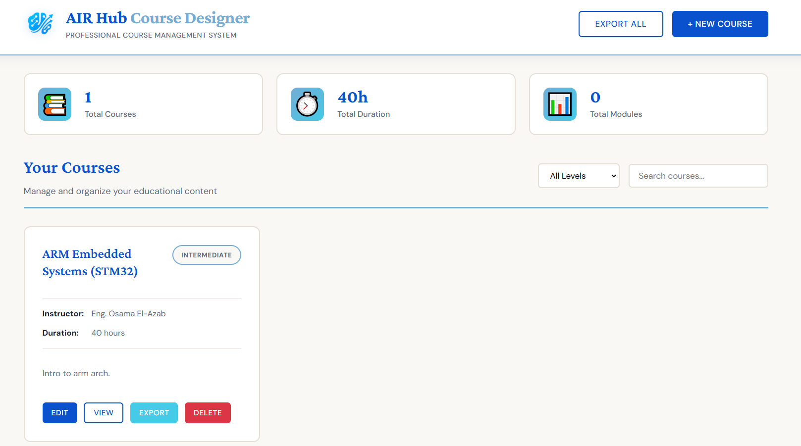

![Logo](https://lh3.googleusercontent.com/rd-d/ALs6j_E4YHlMhYN3b2tskieCC80lxY_9yZn-KEN-Q0BaOcHzNwVZJl31tVLVS-CkYyd2CAkGCg2oI-CRZ1fycud2uO9Eevl8doxN1ikAFzs4LyMzu0uvQMTYqJEUkJm9UUMqHnowoVoUdV9EmobHcKlvPwj4oR6ppaDn7E6kcoMs9tBIr41SH_xCed0SFgOx5jx65_InCEhpwL0C6Sji0lJPf1RnDzGVUZPySBF41rmFzugm-Br6soAF4f5ZwYv3UY3B7QeFJ4yzq9pv0Y8qcGoZwQ-SfAJa-QAaPcvJKCgPVgjrSFxyFHs7xvwkV28eIfLAz_yGSCIhsIh3CJg49vUHi3b36Z0dTTkQfDjYLwgtKeF6qkSsUUniYRL2SUED13t-yNqubbVixXk3U_nGb3jIeHKVpmrRRHBDc2C3stX9wPkjapnAyI25Kf1-YWNuwl2oqQvnoK5hoS2Yxdu0lnjJTa34m2SH1w37Ox7MoVFtmISdSMrI3hIJuUHq2qVQt-0GqJ619vMlNgrpvSbOICsJL9TAZmnoLCmMa1Ht-MdMi2ORsJNR8W76YfFdaBRJVZJWxeKMcPtVQrzp7vxrcA69LpDB66NZqDZwZmcAPdfBPI9OFQrqETBT9RDi7cN43IdyU23pRMAp0PldzIurKr9mAd7q571k_8ZQi4hWJrzhcqAc0tW3LK_zE9HA6GFd4Xr9B2GMKFwWdTqNyBr1Oh0NkgumA_4Tgky27sZasb3BVIUyIp6G-O76_Qt9f5jU6ZrPm67X0FoCYu5r9Z9U3ZO0nz5M2zm_c_eyFbnDQCpl5qzkxcMEZcH1voU0nGWJSCJs1ce4uYlS6jn6205EDKBaGxfsgoq5Mv1fmQZmMeT2tuZ95lKP2zqzQ8YtYYa_Iv__Y9xXvWsx2TihEE-p27jIJn5wSndPhY4unTNwgDpTIPY-XlbCLlbIwi2ZrnQW-9x8-epQ0e0LL1EwIUrp9Xo1yn0yEE-VRdYF0eHXkmUxtJVzIoHEsutBV-Ub_N-u8WhmNFk9aVERlMvz=w1920-h922?auditContext=thumbnail&auditContext=prefetch)


# Course Creation Guide with AIRHC Designer

**This guide will walk you through creating, managing, and organizing your courses step by step.**

---

## Table of Contents

1. [Getting Started](#getting-started)
2. [Creating Your First Course](#creating-your-first-course)
3. [Course Structure Best Practices](#course-structure-best-practices)
4. [Adding Learning Objectives](#adding-learning-objectives)
5. [Creating Course Modules](#creating-course-modules)
6. [Managing Your Courses](#managing-your-courses)
7. [Exporting and Sharing](#exporting-and-sharing)
8. [Tips for Success](#tips-for-success)

---

## Getting Started

### Accessing the Platform

1. Open your web browser
2. Navigate to the Course Designer AIR Hub URL (provided by your administrator)
3. You'll see the dashboard with your courses

### Understanding the Dashboard

The main screen shows:
- **Total Courses** - Number of courses you've created
- **Total Duration** - Combined time of all courses
- **Total Modules** - Total modules across all courses
- **Course Cards** - Visual cards for each course

---

## Creating Your First Course

### Step 1: Click "New Course"

Click the **"+ New Course"** button in the top-right corner.

### Step 2: Fill in Basic Information

#### Course Title **(Required)**
- Be clear and descriptive
- Example: "Introduction to Python Programming"
- Example: "Digital Marketing Fundamentals"
- **Good**: "Advanced Excel for Data Analysis"
- **Bad**: "Excel Course" (too vague)

#### Instructor Name **(Optional)**
- Your name or the instructor's name
- Example: "Eng. Osama Medhat"
- Example: "Marketing Team"

#### Level **(Required)**
Choose from:
- **Beginner** - No prior knowledge needed
- **Intermediate** - Some basic understanding required
- **Advanced** - Expert-level content

#### Duration **(Optional)**
Estimated time to complete the course
- Examples: "8 weeks", "40 hours", "3 months"
- Be realistic about time commitments

#### Description **(Required)**
Write a comprehensive overview:
- What the course covers
- Who it's for
- What students will gain
- Prerequisites (if any)

**Example:**
```
This course provides a comprehensive introduction to Python programming.
Perfect for complete beginners, you'll learn programming fundamentals,
data structures, and how to build real-world applications. No prior
coding experience required.
```

---

## Course Structure Best Practices

### Planning Your Course

Before creating modules, outline:

1. **Main Topics** - What are the key subjects?
2. **Logical Flow** - What order makes sense?
3. **Time Distribution** - How long for each section?
4. **Milestones** - What should students achieve?

### Example Course Structure

**Course:** "Web Development Bootcamp"

```
Module 1: HTML Basics (Week 1)
├── Understanding HTML structure
├── Common HTML tags
└── Creating your first webpage

Module 2: CSS Styling (Week 2)
├── CSS selectors and properties
├── Layout techniques
└── Responsive design

Module 3: JavaScript Fundamentals (Weeks 3-4)
├── Variables and data types
├── Functions and events
└── DOM manipulation

Module 4: Building Projects (Weeks 5-8)
├── Portfolio website
├── Interactive web app
└── Final project
```

---

## Adding Learning Objectives

### What Are Learning Objectives?

Learning objectives describe what students will be able to **DO** after completing your course.

### Writing Effective Objectives

Use action verbs:
-  **Understand**, **Explain**, **Demonstrate**
-  **Create**, **Analyze**, **Evaluate**
-  **Apply**, **Design**, **Build**

### Examples

**Good Learning Objectives:**
-  "Explain the fundamental concepts of object-oriented programming"
-  "Create responsive web layouts using CSS Grid and Flexbox"
-  "Analyze data sets using Python pandas library"
-  "Design and implement a RESTful API"

**Poor Learning Objectives:**
-  "Know about programming" (too vague)
-  "Learn Python" (not specific enough)
-  "Understand coding" (no measurable outcome)

### Adding Objectives in the Platform

1. In the course creation form, find **"Learning Objectives"** section
2. Click **"+ Add Objective"** to add a new objective
3. Type your objective in the text field
4. Click **"+ Add Objective"** again for more objectives
5. Remove unwanted objectives by clicking **"Remove"**

**Recommended:** Add 4-8 objectives per course

---

## Creating Course Modules

### What is a Module?

A module is a major section of your course that covers a specific topic or theme. Think of modules as "chapters" in your course.

### Module Best Practices

#### 1. Keep Modules Focused
- Each module should cover ONE main topic
- Break large topics into multiple modules

#### 2. Use Clear Titles
- **Good**: "Module 1: Introduction to Variables and Data Types"
- **Good**: "Module 3: Building Your First Web Application"
- **Bad**: "Module 2: Stuff" (not descriptive)

#### 3. Write Detailed Descriptions
Include:
- What will be covered
- Estimated time
- Prerequisites (if any)
- Key takeaways

### Example Module

**Module Title:**
"Introduction to Python Variables and Data Types"

**Module Description:**
```
In this module, you'll learn the foundation of Python programming:
working with variables and understanding different data types.

Topics covered:
- Creating and naming variables
- Integers, floats, and strings
- Boolean values and None
- Type conversion
- Common operations for each type

Estimated time: 3 hours
Prerequisites: None (Module 1)

By the end of this module, you'll be able to create variables,
understand data types, and perform basic operations in Python.
```

### Adding Modules in the Platform

1. Scroll to the **"Course Modules"** section
2. Click **"+ Add Module"** button
3. Fill in **Module Title** (required)
4. Fill in **Module Description** (optional but recommended)
5. Add more modules as needed
6. Remove modules with the **"Remove Module"** button

**Recommended:** 4-12 modules per course

---

## Managing Your Courses

### Viewing Your Courses

All your courses appear as cards on the main dashboard. Each card shows:
- Course title
- Level badge
- Instructor name
- Duration
- Number of modules
- Number of objectives
- Brief description

### Course Actions

Each course card has four buttons:

####  **Edit**
- Modify any course information
- Add/remove objectives
- Add/remove modules
- Update descriptions

####  **View**
- See complete course details
- Review all objectives and modules
- Check creation and update dates
- Read full descriptions

####  **Export**
- Download course as JSON file
- For backup or sharing
- Can be imported later

####  **Delete**
- Permanently remove the course
- Cannot be undone - be careful!

### Searching and Filtering

#### Search Bar
- Type keywords to search courses
- Searches in: titles, descriptions, instructor names

#### Level Filter
- Filter by: Beginner, Intermediate, Advanced
- Select "All Levels" to see everything

---

## Exporting and Sharing

### Exporting a Single Course

1. Find your course card
2. Click the **"Export"** button
3. A JSON file will download automatically
4. File name format: `course-[title]-[id].json`

### Exporting All Courses

1. Click **"Export All"** button in the header
2. All courses download as one JSON file
3. Great for backing up your work

### What to Do with Exported Files

- **Backup**: Keep copies of your work
- **Share**: Send to instructors or colleagues
- **Version Control**: Save different versions
- **Transfer**: Move courses between systems

### File Storage Tips

Create a organized folder structure:
```
My Courses/
├── Backups/
│   ├── 2024-01-15-all-courses.json
│   └── 2024-02-01-all-courses.json
├── Individual Courses/
│   ├── python-basics-course.json
│   ├── web-dev-course.json
│   └── data-science-course.json
└── Shared/
    └── shared-with-team.json
```

---

## Tips for Success

### 1. Start Simple
- Create your first course with just 2-3 modules
- Add more complexity as you get comfortable
- It's easier to expand than to simplify

### 2. Be Consistent
- Use similar structure across courses
- Keep naming conventions consistent
- Maintain similar module lengths

### 3. Write for Your Audience
- **Beginner courses**: More explanation, simpler language
- **Intermediate courses**: Assume some knowledge
- **Advanced courses**: Technical depth, less hand-holding

### 4. Regular Updates
- Review courses periodically
- Update outdated information
- Add new modules as needed

### 5. Use Descriptive Names
All titles should be clear:
- Course title: What's the subject?
- Module title: What's this section about?
- Objectives: What will students do?

### 6. Plan Before Creating
Spend 10-15 minutes planning:
- Sketch course outline on paper
- List main topics
- Determine module structure
- Then create in the system

### 7. Save Frequently
The system saves automatically, but good practice:
- Create course with basic info first
- Add objectives one at a time
- Add modules incrementally
- Review before finalizing

### 8. Get Feedback
- Share exported courses with colleagues
- Ask for reviews on structure
- Test with a small group first
- Iterate based on feedback

---

## Common Mistakes to Avoid

###  Don't:
- Create one giant module instead of breaking it down
- Use vague titles like "Module 1" without description
- Skip learning objectives (they're important!)
- Forget to add duration information
- Make objectives too broad ("Learn everything about...")
- Copy-paste content without customization

###  Do:
- Break content into digestible modules
- Write clear, descriptive titles
- Include 4-8 specific learning objectives
- Estimate realistic time commitments
- Make objectives measurable and specific
- Customize content for your audience

---

## Frequently Asked Questions

### Q: How many modules should a course have?
**A:** Typically 4-12 modules. More than 15 becomes overwhelming.

### Q: Can I edit a course after creating it?
**A:** Yes! Click "Edit" on any course card to make changes.

### Q: What happens if I delete a course?
**A:** It's permanently removed and cannot be recovered. Export first if you might need it later.

### Q: Can I duplicate a course?
**A:** Export the course, then manually create a new one using the exported data as a template.

### Q: How long should module descriptions be?
**A:** 2-5 sentences is ideal. Include what's covered and time estimate.

### Q: What's the difference between objectives and module descriptions?
**A:** Objectives state what students will **achieve**. Module descriptions explain what will be **covered**.

### Q: Can I reorder modules after creating them?
**A:** You'll need to edit the course and manually adjust the module order by removing and re-adding them in the desired sequence.

### Q: Should I include prerequisites in the description?
**A:** Yes! Always mention if students need prior knowledge.

### Q: How do I know if my course is ready?
**A:** Ask yourself:
- Is the title clear?
- Are objectives specific and measurable?
- Do modules flow logically?
- Is there a clear progression?
- Would someone understand what they'll learn?

---


# Usage

**1. Start the server:**
```bash
npm start
```

**2. Open in browser:**
```
http://localhost:3000
```

